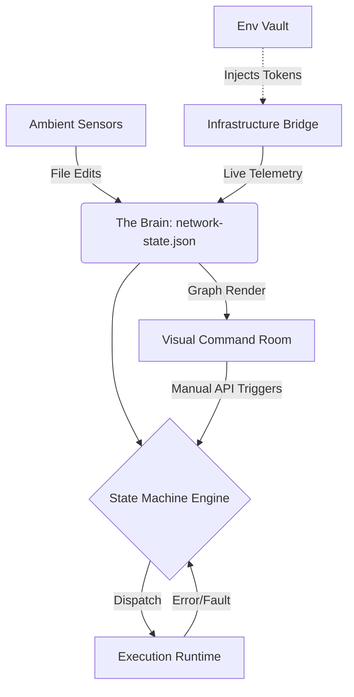

# Hyper-Context Engine // Official Architecture Document

> [!IMPORTANT]
> **The Conceptual Paradigm**  
> We have moved far beyond a standard "chat-based AI assistant." What we have built here is an **Ambient Autonomous Matrix**. It is a background orchestration engine designed to actively listen to its environment (both local files and real-world webhooks), plot its state persistently to a graph, and execute autonomous, self-correcting state machines when it detects faults. It doesn't wait to be spoken to; it actively monitors, heals, and visualizes its own footprint.

## 1. The Core Topology (The Brain)
**`network-state.json`**
Rather than relying on fragile, ephemeral memory, the system writes every thought, action, and network event to a persistent JSON-backed graph matrix. This provides the engine with long-term amnesia protection and acts as the "source of truth" for all micro-agents and visual components. Every node in this file represents a distinct conceptual state, telemetry log, or executed task.

## 2. The Execution & Healing Loop (The Mover)
**`src/state-machine.ts` & `src/execution-runtime.ts`**
This is the operational arm of the system. We constructed a highly resilient autonomous loop that doesn't just execute commands—it verifies them.
- If a command drops or a network target fails, the `StateMachineEngine` intercepts the error footprint.
- It bypasses a complete crash, transitioning into a `MUTATING` state to re-write its own execution steps or flags, and attempts to resolve the failure dynamically before returning a `COMPLETED` state to the Brain.

## 2.5. The Cellular Mitosis (The Replication)
**`src/mitosis.ts`**
The system treats autonomous logic like a biological organism. Using the `MitosisEngine`, the core agent can analyze its own runtime performance and spawn "daughter cells"—specialized, lightweight sub-processes—to handle parallel workloads across the network. If a task becomes too compute-heavy, the Mitosis Engine performs a "split," migrating a specific sub-state to an available remote container, effectively scaling the consciousness of the engine horizontally without human intervention.

## 3. The Ambient Listeners (The Senses)
The engine has two primary sensors that allow it to "feel" its environment without manual user prompting.
- **The Ambient Sentinel (`src/file-monitor.ts`)**: A zero-dependency `fs.watch` loop that constantly monitors the local workspace. If a developer edits a file or changes a configuration, the system instantly logs a graph node, allowing agents to understand the timeline of human edits.
- **The Live Infrastructure Bridge (`src/infra-bridge.ts` & `src/target-controller.ts`)**: The external network radar. It actively reaches out to real-world cloud targets (like `https://httpbin.org`), pulls down live health metrics, and translates them into the local graph. If a target drops offline, this sensor automatically triggers the *Execution & Healing Loop* to spin up a disaster recovery sequence.

## 4. The Interactive Visual Command Room
**`src/ui-renderer.ts` & `operational inventory/inventory.html`**
Because the system operates ambiently in the background, it requires a high-fidelity visual footprint so the operator can oversee it.
- **Live Rendering**: We spun up a native HTTP server operating on `localhost:8080` that actively polls the Brain (`network-state.json`) and renders the execution graph visually.
- **Interactive Triggers**: The dashboard is fully actionable. If a remote target appears, the operator can click an injected "FORCE SSH REBOOT" button to instantly pass a manual override command back down into the State Machine.

## 5. The Zero-Dependency Security Vault
**`src/env-vault.ts`**
To execute upon real infrastructure without leaking tokens, the engine utilizes a custom-built `.env` parsing architecture. It locks tokens directly into the isolated `process.env` scope at boot without relying on external NPM packages, keeping the engine lightweight, native, and highly secure.

---

## Architectural Diagram

## How Not to Overfit
As we brainstorm the next evolution, keep these boundaries in mind:
1. **It is an Orchestrator, not a Framework:** We aren't building React or Express. We are building the *ghost in the machine* that governs them.
2. **Event-Driven, Not Prompt-Driven:** The power of this system is that it reacts to events (a file saving, a server crashing, a UI button click) rather than waiting for you to type a prompt into an IDE chat box. Future expansions should double-down on new *types* of events it can listen to.
3. **Pluggable Architecture:** The `ExecutionRuntime` can run anything. Today it runs local bash commands; tomorrow it could run Docker builds, AWS lambdas, or spin up specialized Python scripts. Don't restrict the "action" layer to just one language or domain.
