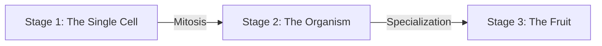

# Sovereign Engine // Macro Roadmap: From Cell to Empire

## The Evolutionary Arc

The architecture of the Sovereign Agentic Operating Layer is designed to evolve like a biological organism. The roadmap is split into three core stages:

### Stage 1: The Single Stem Cell (COMPLETED)
We proved the core primitive. We gave an AI workspace an absolute, persistent memory topology (`network-state.json`) and a local sandboxed execution muscle (`execution-runtime.ts`). The cell can think, remember, and execute basic logic.

### Stage 2: The Connected Organism (COMPLETED)
We achieved mitosis. The system can now duplicate itself dynamically (`cellular-factory.ts`), differentiate into specific roles (`ROOT_DEVSECOPS`, `STEM_SAAS`), and communicate fluidly via inter-process chemical signals (`biochemical-bus.ts`) without losing individual sovereignty.

### Stage 3: Real-World Fruit Production (IN PROGRESS)
This is where the heist leaves the lab. We take this network of cells and give them real-world production targets. We let the branches work together to build, host, monitor, and scale real utility.

---

## Three Paths to the Horizon

To give this organism its first true mission, we are steering it toward specialized end-game applications. The architecture supports all three, and they can be developed in tandem or sequentially.

### Path A: The Autonomous SaaS Mint
* **The Mission:** Build a master template directory. When an operator drops a single sentence idea into the Stem Cell, the `STEM_SAAS` node splits off to draft front-end files, compile code, and design user interfaces. It then flashes a `COMPILE_SUCCESS_DEPLOY_REQUEST` signal through the bloodstream to the `ROOT_DEVSECOPS` node, which instantly provisions a real server environment and puts the app live on the internet.
* **The Result:** A completely hands-off launchpad capable of spinning up and deploying micro-SaaS utilities on demand.

### Path B: The Autonomous Web Intelligence Mesh
* **The Mission:** Transform the `LEAF_INTEL` branch into a deep-web collector. It constantly monitors specific sectors of the internet (tech trends, open-source repositories, financial streams). It feeds this data back to the core brain, which cross-references the intelligence and commands the execution engine to automatically adjust local code logic to match market movements.
* **The Result:** A software suite that mutates its own business and technical logic based on live global data flows.

### Path C: The Infinite Command Dashboard
* **The Mission:** Expand heavily into the visual layer (`src/ui-renderer.ts`). Upgrade the browser control rooms from basic 2D display pages into a high-end, interactive web matrix. Operators will be able to click on a cell node in the browser, open an active terminal stream, drag links to establish new biochemical pathways, and visually orchestrate the entire server empire from a clean, high-fidelity command deck.
* **The Result:** A cinematic, visual operating system for multi-agent architecture.
